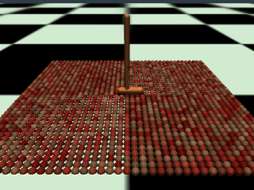
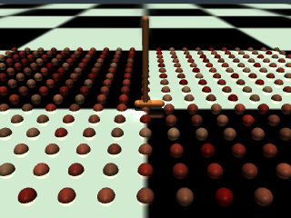
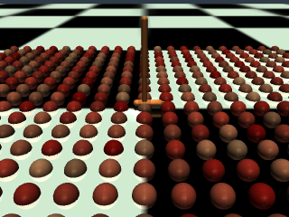
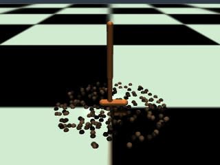
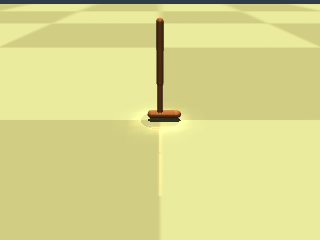

# TerrainBasedSwitching
TSP or Terrain Based Switching 

## Introduction
There are 3 types of envs:
1. Cobblestone
2. Gravel
3. Sandpaper

### 1. Cobblestone
#### 1.1. Cobblestone

#### 1.2. Loose Cobblestone



### 2. Gravel


### 3. Sandpaper


## Relevant Files
```

├── README.md
├── images
├── TSP
│   ├── xml
│   │   ├── cobblestone_hopper.xml
│   │   ├── cobblestone_hopper_loose_v1.xml
│   │   ├── cobblestone_hopper_loose_v2.xml
│   │   ├── sandpaper_hopper.xml
│   │   └── gravel_hopper.xml
│   ├── notebooks
|   |   ├── train
│   │   |   ├── baseline_online_RL.ipynb
│   │   |   ├── cobblestone_hopper_loose_v1.ipynb
│   │   |   ├── standard_hopper.ipynb
│   │   |   ├── sandpaper_hopper.ipynb
│   │   |   ├── TSP_oracle.ipynb
│   │   |   └── TSP.ipynb
│   │   └── test
│   │       ├── Evaluation.ipynb
│   │       └── Visualization.ipynb
│   ├── policies
│   │   ├── cobblestone_hopper_loose_v1
│   │   ├── standard_hopper
│   │   ├── sandpaper_hopper
|   |   ├── online_RL_policy
|   |   ├── TSP_oracle
│   │   └── TSP
│   └── data
│       └── data_generation
├── archive (temporary)

```

## How to run

### 1. Open the notebook in colab 

### 2. Run the notebook until 'allowing access to google drive' cell

### 3. Mount google drive, and Create a folder envs/ inside the following directory:
```
 usr/local/lib/python3.7/dist-packages/gym/envs/mujoco/assets
```
### 4. Copy the xml files from TSP/xml/ to the envs/ folder

### 5. Run the rest of the notebook

## Results

Here we include a short video of the TSP agent in action. The agent is trained on the cobblestone environment and is tested on the sandpaper environment. The agent is able to adapt to the new environment and perform well.


<!-- [](https://youtu.be/X2ErCV9k9AE) -->

<a href="http://www.youtube.com/watch?feature=player_embedded&v=X2ErCV9k9AE" target="_blank">
 
</a>